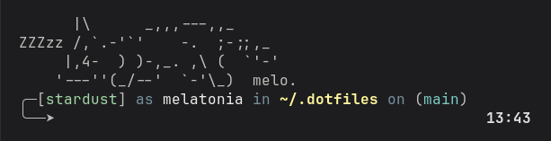

# melatonia's dotfiles

my ~/.dotfiles that are managed by [stow](https://github.com/aspiers/stow)

tools that i love to use:
zsh, zsh-autosuggestions, zsh-syntax-highlighting, stow, helix, fzf, zoxide, lazygit,eza

---

## installation

'mkdir -p ~/.dotfiles && git clone https://github.com/melatonia/dotfiles.git ~/.dotfiles'

set zsh as your default shell:
'chsh -s $(which zsh)'

---

### extras

  

    <h3>godot theme</h3>
  

base color: #262626 or (rgb: 38,38,38)
contrast: 0.17

---

## 🍀 credits

the zsh prompt is inspired by the [jovial](https://github.com/zthxxx/jovial) theme. aimed to strip away the oh my zsh dependency.

go leave them a star! ⭐

---

_all the world is lucky to be your home_ 🌿

